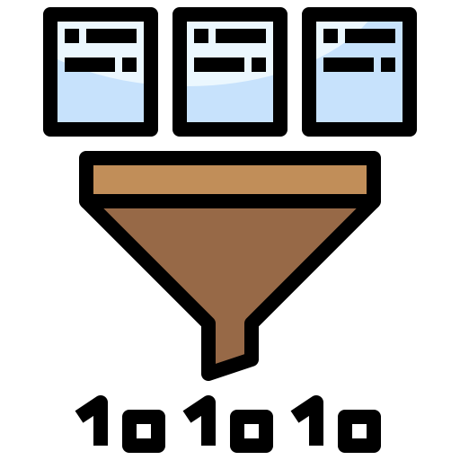

# Bloom filter
From Wikipedia a [Bloom filter](https://en.wikipedia.org/wiki/Bloom_filter) is a space-efficient probabilistic data structure, conceived by Burton Howard Bloom in 1970, that is used to test whether an element is a member of a set. False positive matches are possible, but false negatives are not – in other words, a query returns either "possibly in set" or "definitely not in set". Elements can be added to the set, but not removed (though this can be addressed with the counting Bloom filter variant); the more items added, the larger the probability of false positives.



## Applications
Bloom filters can be applied to many situations where such a data structure can be benificial. For example:

* Google Bigtable, Apache HBase and Apache Cassandra and PostgreSQL use Bloom filters to reduce the disk lookups for non-existent rows or columns. Avoiding costly disk lookups considerably increases the performance of a database query operation.
* The Google Chrome web browser used to use a Bloom filter to identify malicious URLs. Any URL was first checked against a local Bloom filter, and only if the Bloom filter returned a positive result was a full check of the URL performed (and the user warned, if that too returned a positive result).
* Medium uses Bloom filters to avoid recommending articles a user has previously read.
* etc etc

## Scoping the code kata
There are many extensions to the Bloom filter for optimization for various scenarios. In this code kata we settle with the simplest setup possible.

The mathematical derivation on wikipedia gives us the following relations to work with:


Term | Explanation   
--- | :--- 
_m_ | _number of bits_
_n_ | _expected insertions_
_ε_ | _false positive probability_ 
_k_ | _number of hash functions_
 
Let us use that to design our Bloom filter with the goal of being able to create an instance in the following way for example:
```java
final BloomFilter bloomFilter = BloomFilter.builder()
    .expectedInsertions(1000000)
    .falsePositiveProbability(0.01)
    .build();
```

__Files__

We have three files to work with to verify our implementation.

 * We have a file `allMaliciousSites.csv` containing 999.200 URLs marked as malicious for the sake of this exercise.
 * We also have a file `maliciousUserInput.csv` containing 200 URLs that should have been marked as malicious and put in the filter.
An important features of a Bloom filter is that it should never yield a false negative answer on the question `if the filter might contain this URL` for example.
* The final file is `okUserInput.csv` containing 800 URLs that should NOT have been marked as malicious. However, the filter is allowed to yield a false positive answer
stating a URL to be suspected as malicious even though it is in fact not.